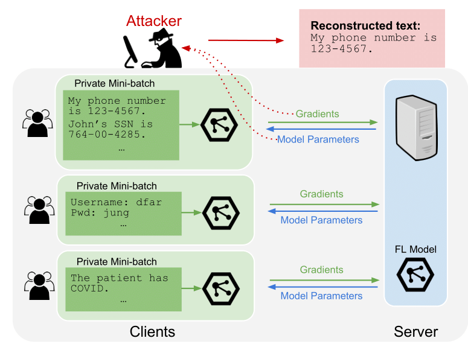
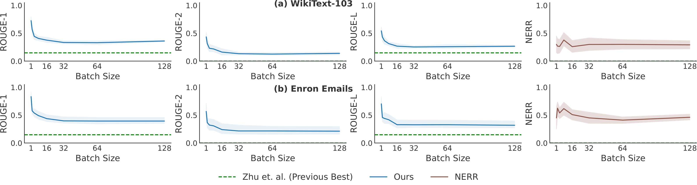

# Recovering Private Text in Federated Learning of Language Models

Samyak Gupta*, Yangsibo Huang*, Zexuan Zhong, Tianyu Gao, Kai Li, Danqi Chen (*: equal contribution)
> 
> Federated learning allows distributed users to collaboratively train a model while keeping each user's data private. Recently, a growing body of work has demonstrated that an eavesdropping attacker can effectively recover image data from gradients transmitted during federated learning. However, little progress has been made in recovering text data. In this paper, we present a novel attack method FILM for federated learning of language models -- for the first time, we show the feasibility of recovering text from large batch sizes of up to 128 sentences. Different from image-recovery methods which are optimized to match gradients, we take a distinct approach that first identifies a set of words from gradients and then directly reconstructs sentences based on beam search and a prior-based reordering strategy. The key insight of our attack is to leverage either prior knowledge in pre-trained language models or memorization during training. Despite its simplicity, we demonstrate that FILM can work well with several large-scale datasets -- it can extract single sentences with high fidelity even for large batch sizes and recover multiple sentences from the batch successfully if the attack is applied iteratively. We hope our results can motivate future work in developing stronger attacks as well as new defense methods for training language models in federated learning.  

<a href="https://arxiv.org/abs/2205.08514"></a>

<p align="center">
  
<br>
</p>

## Description

Official implementation of our NeurIPS 2022 paper [Recovering Private Text in Federated Learning of Language Models](https://arxiv.org/pdf/2205.08514.pdf), where we demonstrate a new method (FILM) in which a participant of federated learning (i.e. a curious server, a malicious client, or an observer of transmitted parameters) may leverage memorization in large language models to reconstruct private client data. We evaluate our approach on Wikitex-103 and the Enron Emails datasets.

If you have any questions related to the code or the paper, feel free to email Samyak (samyakg@princeton.edu) and Yangsibo (yangsibo@princeton.edu). If you encounter any problems when using the code, or want to report a bug, you can open an issue. Please try to specify the problem with details so we can help you better and quicker!

## Table of Contents

- [Recovering Private Text in Federated Learning of Language Models](#recovering-private-text-in-federated-learning-of-language-models)
  * [Description](#description)
  * [Setup](#setup)
  * [Datasets](#datasets)
  * [Running Beam Search](#running-beam-search)
  * [Sentence Reordering](#sentence-reordering)
  * [Pre-trained Models](#pre-trained-models)
  * [Results](#results)
  * [Citation](#citation)

<small><i><a href='http://ecotrust-canada.github.io/markdown-toc/'>Table of contents generated with markdown-toc</a></i></small>


## Setup

To install python requirements:

```bash
conda env create -f environment.yml
conda activate film-nlp
python -m spacy download en_core_web_sm
```

To set up beamsearch code:

First [install Rust](https://www.rust-lang.org/tools/install)

Then, run code as follows:

```bash
cd beamsearch_rust
cargo run --release
```

By default, the beamsearch runs only only CPU. To run with CUDA support, set the `TORCH_CUDA_VERSION` environment variable to `cu113` ([See this link for more information](https://github.com/LaurentMazare/tch-rs))

## Datasets

Our experiments used data from the [Enron Emails Dataset](https://www.cs.cmu.edu/~./enron/) and [Wikitext-103](https://huggingface.co/datasets/wikitext). For convenience, we have included a copy of Enron Emails and a subset of Wikitext-103 in the [experiments folder](experiments).

## Running Beam Search

Beam search can be ran in stand-alone form by running the following command:

```setup
cd beamsearch_rust
cargo run --release -- --datapath <DATAPATH> --outputpath <OUTPUTPATH>
```

Data passed to `datapath` must be a json file of a specific form - see [an example](example_data.json) input for a batch of size 16.

By default, beamsearch will be ran with a pretrained GPT2 model from HuggingFace. For a full list of arguments available during beamsearch, you may run the following command:

```bash
cargo run --release -- --help
```

To run with an existing GPT2 model, you must first convert it to a compatible form using [this tool](https://github.com/guillaume-be/rust-bert/blob/master/utils/convert_model.py). Simply save the model (e.g. using model.save_pretrained in HuggingFace), and then run `python convert_model.py pytorch_model.bin` to convert. Then you may use the generated `rust_model.ot` file during beamsearch as follows:

```bash
cargo run --release -- --modelweights <PATH_TO_RUST_MODEL>
```

We also include a [Python frontend](run_beamsearch.py) which passes down args to the rust beamsearch implementation.
## Sentence Reordering

We also include the code used for sentence reordering in [reorder.py](reorder.py). It can be run as follows:

```bash
python reorder_single.py --bs BATCH_SIZE --alpha 1
```

## Pre-trained Models

We currently do not provide any models fine-tuned on the datasets (will be added to the repository at a later data).

For now, you may use pre-trained models from [HuggingFace](https://huggingface.co/models) and fine-tune on the provided datasets.

## Results
<p align="center">
  
<br>
Recovery performance for various batch sizes on WikiText-103 (a) and the Enron dataset (b). Solid
lines indicate the average F-Scores of recoveries out of 20 tested mini-batches. The attack is overall weaker for
larger batch sizes (see Table 7 for quantitative results). Moreover, the attack is stronger for the Enron dataset.
</p>


## Citation

If you use this code in your research, please cite the following work:
```bibtex
@inproceedings{gupta2022recovering,
   title={Recovering Private Text in Federated Learning of Language Models},
   author={Gupta, Samyak and Huang, Yangsibo and Zhong, Zexuan and Gao, Tianyu and Li, Kai and Chen, Danqi},
   booktitle={Advances in Neural Information Processing Systems (NeurIPS)},
   year={2022}
}
}
```
